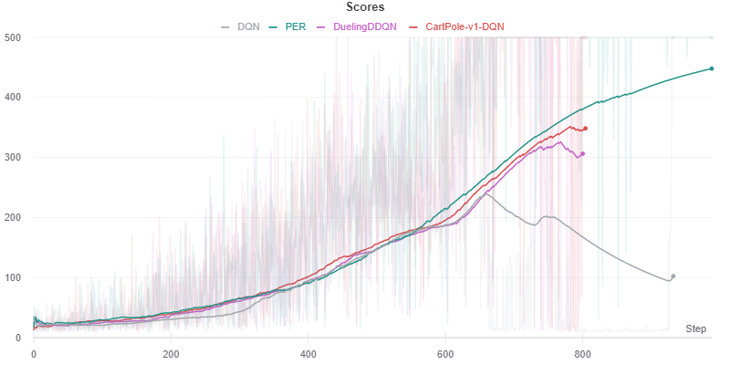
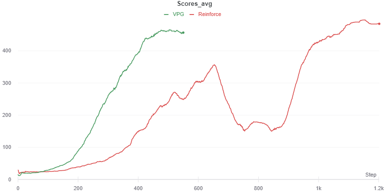
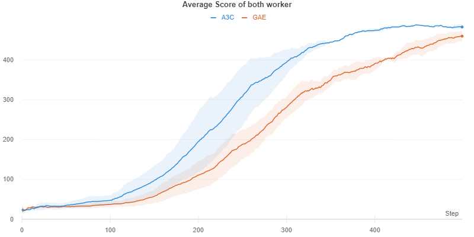
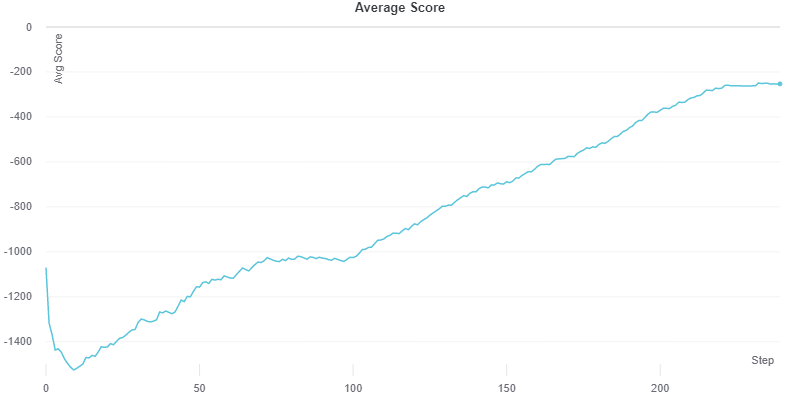
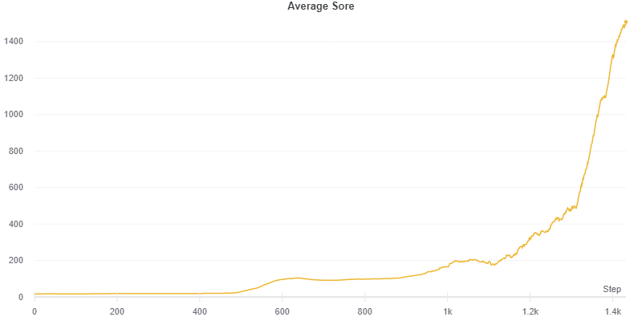

# Deep Reinforcement Learning

This repo contains algoritms of deep RL.

## Algorithms:

### Deep Q-Learning
    1. Simple DQN
    2. Double DQN
    3. Dueling DQN
    4. Dueling DQN with Prioritize Ecperience Replay
Result:

### Policy Gradient
    1. Reinforce
    2. Vanilla Policy Gradient
Result:

### Actor-Critic Methods
    1. Asynchronous Advantage Actor-Critic (A3C)
    2. Generalize Adavantage Estimation (GAE)

    3. Deep Deterministic Policy Gradient (DDPG)

    4. Twin-Delayed DDPG (TD3)

### Videos:
Trained agent's demo videos can be found in folder `./data`

### Problems:
- There is problem with A2C agent. It does not work in Windows. And also there is some error in trainig loop.

- A3C agent can not terminate loop it self after training completed due to multiprocessing. Program must be terminated manually.

- SAC algorithm not working due to pytorch inpalace operation error.