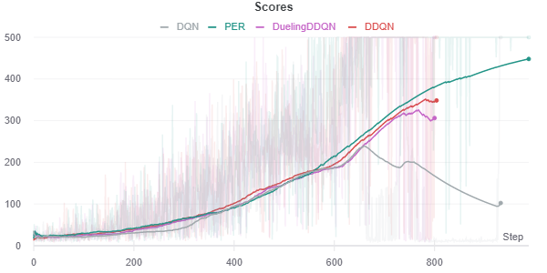

# Deep Reinforcement Learning

This repo contains algoritms of deep RL 

## Algorithms:

### Deep Q-Learning
    1. Simple DQN
    2. Double DQN
    3. Dueling DQN
    4. Dueling DQN with Prioritize Ecperience Replay
Result:

### Policy Gradient
    1. Reinforce
    2. Vanilla Policy Gradient
Result:

### Actor-Critic Methods
    1. Asynchronous Advantage Actor-Critic (A3C)
    2. Generalize Adavantage Estimation
Result:

